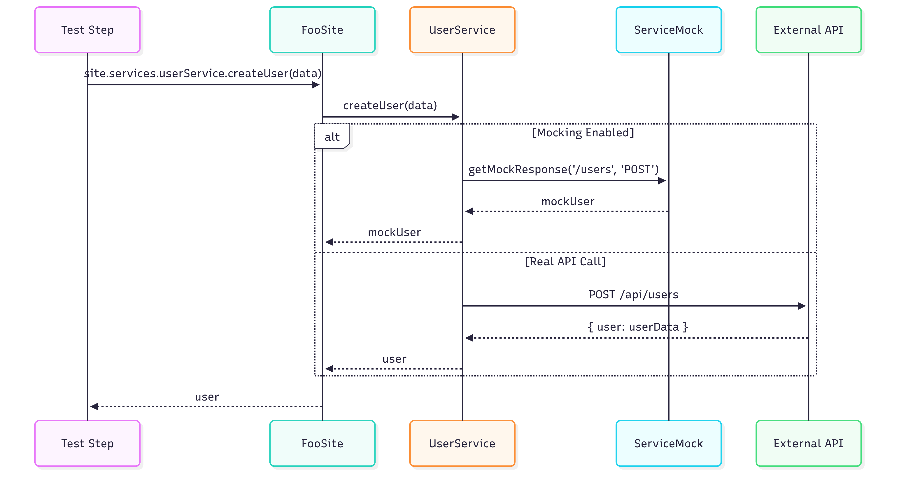
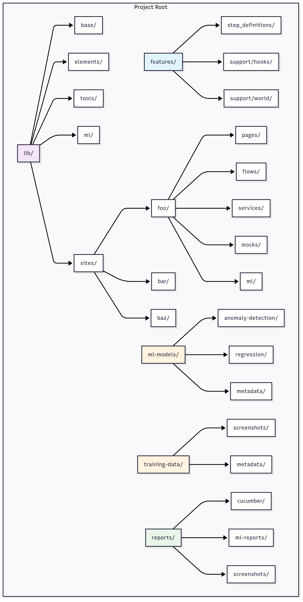

# Playwright Testing Framework - Architectural Overview

## Executive Summary

This document outlines a comprehensive, enterprise-grade testing framework built on Playwright and Cucumber, designed with clean architecture principles and modern testing practices. The framework provides a unified approach to UI, API, infrastructure, and ML-powered visual validation testing through a site-centric facade pattern.

## Core Architecture Principles

### 1. Clean Separation of Concerns

[

### 2. Site-Centric Design Pattern

The **Site** serves as the primary facade providing unified access to all testing capabilities:

[

## Framework Architecture Layers

### 1. UI Testing Layer

[

**Key Components:**
- **Pages**: Container-based page objects with element registration
- **Elements**: Typed UI element wrappers (Button, Input, Link, etc.)
- **Partials**: Reusable UI components across multiple pages
- **Flows**: Business process automation (login, search, checkout)

### 2. API Testing Layer

[

**Key Components:**
- **Service Wrappers**: Type-safe API client wrappers
- **Mock System**: Built-in response mocking with fluent API
- **Request/Response Handling**: Automatic serialization/deserialization
- **Authentication**: Token management and session handling

### 3. Infrastructure Testing Layer

[

**Key Components:**
- **External System Clients**: SSH, databases, message queues, cloud services
- **Connection Management**: Pooling, retry logic, credential handling
- **Health Monitoring**: Connection status and system health checks
- **Resource Cleanup**: Automatic connection management

### 4. ML Visual Validation Layer

[

**Key Components:**
- **Training Pipeline**: Screenshot collection, preprocessing, model training
- **Detection Pipeline**: Model loading, inference, anomaly analysis
- **Model Management**: Versioning, storage, deployment
- **Visual Analysis**: Pixel-level comparison, layout validation, element detection

## Directory Structure & Organization

[

### Framework Organization Principles

1. **Separation by Concern**: Each directory has a single responsibility
2. **Site Isolation**: Each site maintains its own complete structure
3. **Shared Components**: Common elements and tools are reusable
4. **Data Segregation**: ML models and training data are externalized

## Testing Workflow Patterns

### 1. UI-Only Testing Flow

[

### 2. API + UI Integration Testing Flow

[

### 3. Complete Integration Testing Flow

[

## ML Visual Validation Architecture

### Training Workflow

[

### Detection Workflow

[

## Service Architecture & Mocking

### Service Layer Design

[

### Mocking Strategy

[

## Tool Integration Architecture

### External System Connections

[

## Configuration Management

### Multi-Environment Configuration

[

## Performance & Scalability

### Parallel Execution Strategy

[

### Resource Management

[

## Usage Examples

### Basic UI Testing

```typescript
// Step definition example
Given('I am on the homepage', async function (this: CustomWorld) {
  const site = new FooSite(this.page);
  await site.homePage.visit();
});

When('I search for {string}', async function (this: CustomWorld, query: string) {
  const site = new FooSite(this.page);
  await site.searchFlow.execute({ query });
});

Then('I should see search results', async function (this: CustomWorld) {
  const site = new FooSite(this.page);
  const resultsCount = await site.searchPage.getResultsCount();
  expect(resultsCount).toBeGreaterThan(0);
});
```

### API Integration Testing

```typescript
// Combined API + UI testing
Given('I have a user account', async function (this: CustomWorld) {
  const site = new FooSite(this.page);
  
  // Create user via API
  this.testUser = await site.services.userService.createUser({
    email: 'test@example.com',
    password: 'TestPassword123!',
    firstName: 'Test',
    lastName: 'User'
  });
});

When('I login through the UI', async function (this: CustomWorld) {
  const site = new FooSite(this.page);
  await site.loginFlow.execute({
    username: this.testUser.email,
    password: 'TestPassword123!'
  });
});

Then('my profile should show correct information', async function (this: CustomWorld) {
  const site = new FooSite(this.page);
  await site.profilePage.visit();
  
  const displayName = await site.profilePage.getDisplayName();
  expect(displayName).toBe(`${this.testUser.firstName} ${this.testUser.lastName}`);
});
```

### ML Visual Validation

```typescript
// Visual regression testing
Given('I establish a visual baseline', async function (this: CustomWorld) {
  const site = new FooSite(this.page);
  await site.trainers.trainCurrentPage('homepage_baseline');
});

Then('the page should match the baseline', async function (this: CustomWorld) {
  const site = new FooSite(this.page);
  const result = await site.detectors.validateCurrentPage('homepage_baseline');
  
  expect(result.isValid).toBe(true);
  expect(result.confidence).toBeGreaterThan(0.9);
});

And('there should be no layout anomalies', async function (this: CustomWorld) {
  const site = new FooSite(this.page);
  const anomalies = await site.detectors.layoutDetector.detectAnomalies();
  expect(anomalies).toHaveLength(0);
});
```

### Infrastructure Testing

```typescript
// End-to-end integration with infrastructure
Given('I have test data in the system', async function (this: CustomWorld) {
  const site = new FooSite(this.page);
  
  // Setup database
  await site.tools.database.mysql.insertOne('users', {
    id: 'test-user-123',
    email: 'test@example.com'
  });
  
  // Setup message queue
  await site.tools.messaging.amqp.createQueue('test-notifications');
});

When('I trigger a background process', async function (this: CustomWorld) {
  const site = new FooSite(this.page);
  
  // UI action that triggers background processing
  await site.orderPage.submitOrder();
  
  // Verify message was published
  const message = await site.tools.messaging.amqp.waitForMessage('test-notifications');
  expect(message.orderId).toBeDefined();
});

Then('the system should process correctly', async function (this: CustomWorld) {
  const site = new FooSite(this.page);
  
  // Verify database was updated
  const orders = await site.tools.database.mysql.query(
    'SELECT * FROM orders WHERE user_id = ?',
    ['test-user-123']
  );
  
  expect(orders).toHaveLength(1);
  expect(orders[0].status).toBe('processed');
});
```

## Benefits & Value Proposition

### Developer Benefits
- **Unified API**: Single site facade for all testing operations
- **Type Safety**: Full TypeScript support with IntelliSense
- **Clean Architecture**: Clear separation of concerns
- **Easy Extensibility**: Simple to add new capabilities

### Testing Benefits
- **Comprehensive Coverage**: UI, API, infrastructure, visual validation
- **Efficient Workflows**: Reusable flows and components
- **Reliable Results**: Built-in retry logic and error handling
- **Scalable Execution**: Parallel test execution support

### Maintenance Benefits
- **Modular Design**: Independent, reusable components
- **Clear Abstractions**: Easy to understand and modify
- **Version Control**: ML models and configurations are versioned
- **Documentation**: Self-documenting code with clear patterns

### Business Benefits
- **Faster Delivery**: Comprehensive automation reduces manual testing
- **Higher Quality**: ML-powered visual validation catches regressions
- **Cost Effective**: Reusable framework reduces development overhead
- **Risk Mitigation**: Multi-layer testing catches issues early

## Conclusion

This architectural framework provides a comprehensive, scalable solution for modern web application testing. By combining traditional UI testing with API validation, infrastructure testing, and ML-powered visual validation, teams can achieve unprecedented test coverage while maintaining clean, maintainable code.

The site-centric facade pattern ensures that all testing capabilities are easily accessible through a unified interface, while the clean architecture principles ensure long-term maintainability and extensibility. The framework is designed to grow with your testing needs, from simple UI tests to complex integration scenarios involving multiple systems and services.

